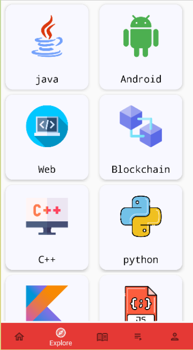
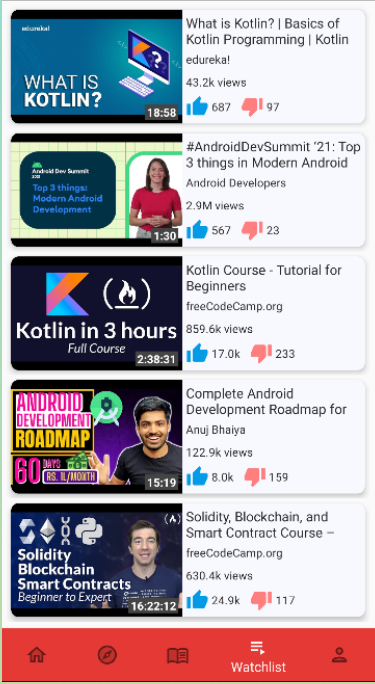

# StudyTube
* StudyTube is an android app developed using Kotlin and firebase.
* It is youtube but only for programmers.
* uses Youtube's Data API to fetch all the videos from youtube.
* uses Firebase as a backend.

# Screenshots
<table align="center">
  <tr>
    <td></td>
    <td></td>
    <td></td>
  </tr>
  <tr>
    <td align="center"><b>Google SignIn</b></td>
    <td align="center"><b>Dashboard</b></td>
    <td align="center"><b>Explore</b></td>
  </tr>
  
  </table>
  
  
  
  
  
  <table align="center">

  <tr>
    <td></td>
    <td></td>
    <td></td>
  </tr>
  <tr>
    <td align="center"><b>Videos</b></td>
    <td align="center"><b>Video Player</b></td>
    <td align="center"><b>Wishlist</b></td>
  </tr>
 </table>
 
